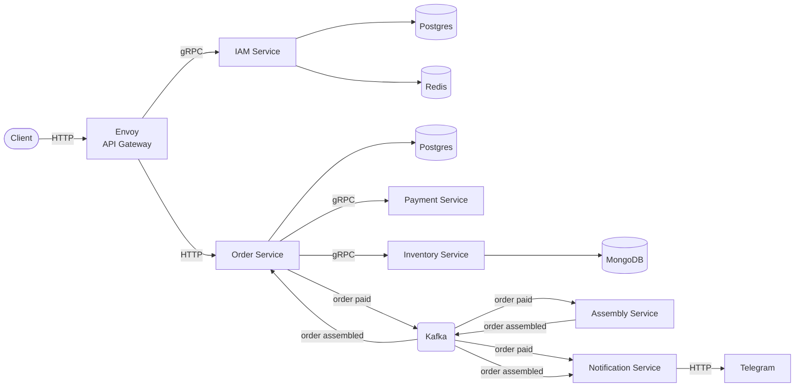

# factory


## Services

```mermaid
flowchart LR
    %% ==== CLIENT & ENVOY ====
    Client([Client]) -->|HTTP| Envoy[Envoy<br/>API Gateway]

    %% ==== IAM SERVICE ====
    Envoy -->|gRPC| IAM[IAM Service]
    IAM --> Postgres1[(Postgres)]
    IAM --> Redis[(Redis)]

    %% ==== ORDER SERVICE ====
    Envoy -->|HTTP| Order[Order Service]
    Order --> Postgres2[(Postgres)]

    %% ==== PAYMENT SERVICE ====
    Order -->|gRPC| Payment[Payment Service]

    %% ==== INVENTORY SERVICE ====
    Order -->|gRPC| Inventory[Inventory Service]
    Inventory --> MongoDB[(MongoDB)]

    %% ==== KAFKA BUS ====
    Order -->|order paid| Kafka(Kafka)
    Kafka -->|order assembled| Order
    Kafka -->|order paid| Assembly[Assembly Service]
    Assembly[Assembly Service] -->|order assembled| Kafka
    Kafka -->|order paid| Notification[Notification Service]
    Kafka -->|order assembled| Notification[Notification Service]
    Notification -->|HTTP| Telegram[Telegram]
```


## Commands

- Run unit-tests:
```
task test:unit
```

- Run integration-tests:
```
task test:integr
```

- See test's coverage:
```
task coverage:html
```
