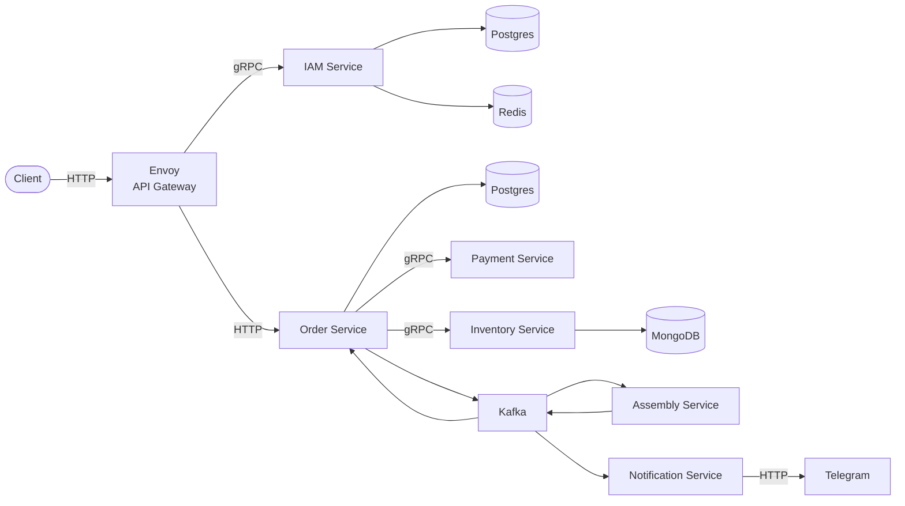

# factory

## Services

в пятой домашке делаем два топика в кафке - OrderPaid, ShipAssembled
И для каждого топика будет по одному продюсеру и по два консьюмера?

OrderServiceProducer шлет в топик OrderPaid из которого читают два консьюмера AssemblyServiceConsumer и NotificationServiceConsumer.

AssemblyServiceProducer шлет в топик ShipAssembled из которого читают два консьюмера OrderServiceConsumer и NotificationServiceConsumer.
