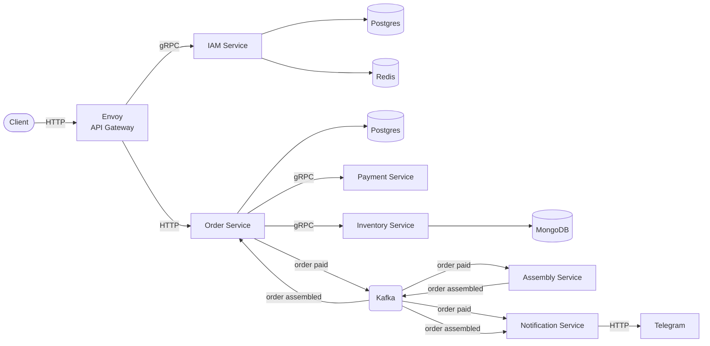
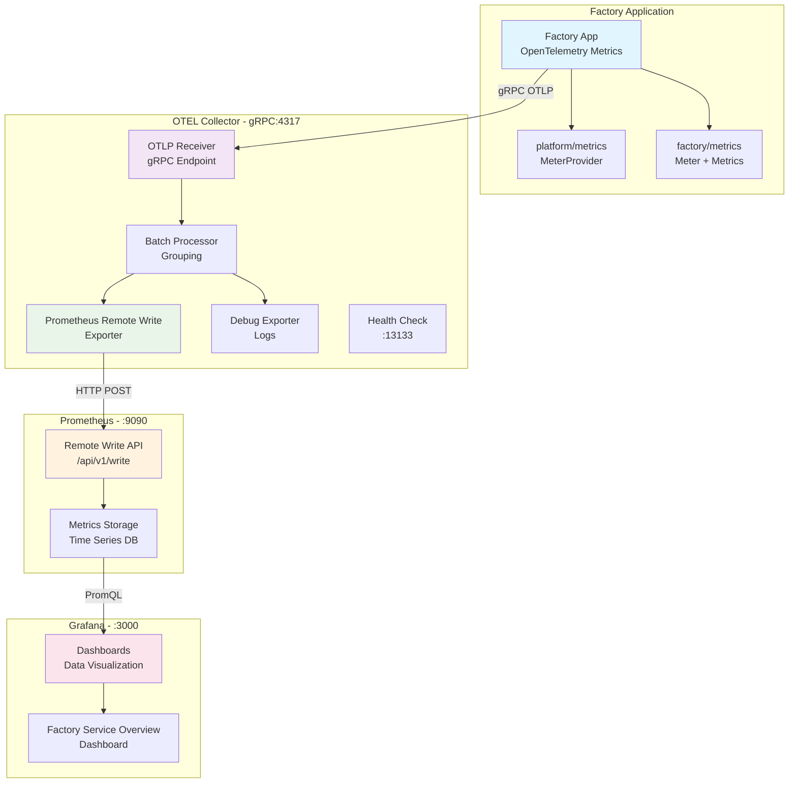

# factory


## Services

```mermaid
flowchart LR
    %% ==== CLIENT & ENVOY ====
    Client([Client]) -->|HTTP| Envoy[Envoy<br/>API Gateway]

    %% ==== IAM SERVICE ====
    Envoy -->|gRPC| IAM[IAM Service]
    IAM --> Postgres1[(Postgres)]
    IAM --> Redis[(Redis)]

    %% ==== ORDER SERVICE ====
    Envoy -->|HTTP| Order[Order Service]
    Order --> Postgres2[(Postgres)]

    %% ==== PAYMENT SERVICE ====
    Order -->|gRPC| Payment[Payment Service]

    %% ==== INVENTORY SERVICE ====
    Order -->|gRPC| Inventory[Inventory Service]
    Inventory --> MongoDB[(MongoDB)]

    %% ==== KAFKA BUS ====
    Order -->|order paid| Kafka(Kafka)
    Kafka -->|order assembled| Order
    Kafka -->|order paid| Assembly[Assembly Service]
    Assembly[Assembly Service] -->|order assembled| Kafka
    Kafka -->|order paid| Notification[Notification Service]
    Kafka -->|order assembled| Notification[Notification Service]
    Notification -->|HTTP| Telegram[Telegram]
```


## Quick start
1. ```task docker:up-all``` - run infrastructure
2. ```task run:order``` - for each service in separate terminal


## Система мониторинга с OpenTelemetry, Prometheus и Grafana

```mermaid
graph TB
    subgraph "Factory Application"
        A[Factory App<br/>OpenTelemetry Metrics]
        B[platform/metrics<br/>MeterProvider]
        C[factory/metrics<br/>Meter + Metrics]
        A --> B
        A --> C
    end
    
    subgraph "OTEL Collector - gRPC:4317"
        D[OTLP Receiver<br/>gRPC Endpoint]
        E[Batch Processor<br/>Grouping]
        F[Prometheus Remote Write<br/>Exporter]
        G[Debug Exporter<br/>Logs]
        H[Health Check<br/>:13133]
        D --> E
        E --> F
        E --> G
    end
    
    subgraph "Prometheus - :9090"
        I[Remote Write API<br/>/api/v1/write]
        J[Metrics Storage<br/>Time Series DB]
        I --> J
    end
    
    subgraph "Grafana - :3000"
        K[Dashboards<br/>Data Visualization]
        L[Factory Service Overview<br/>Dashboard]
        K --> L
    end
    
    A -->|gRPC OTLP| D
    F -->|HTTP POST| I
    J -->|PromQL| K
    
    style A fill:#e1f5fe
    style D fill:#f3e5f5
    style F fill:#e8f5e8
    style I fill:#fff3e0
    style K fill:#fce4ec
```

### Поток данных:
1. Factory App собирает метрики через OpenTelemetry SDK
2. Метрики отправляются в OTEL Collector по gRPC (порт 4317)
3. Collector батчует метрики и отправляет в Prometheus через Remote Write API
4. Grafana визуализирует данные из Prometheus через PromQL запросы


## Commands

- Run unit-tests:
```
task test:unit
```

- Run integration-tests:
```
task test:integr
```

- See test's coverage:
```
task coverage:html
```


## TODO
- в сервисе order сделать накат миграций как в iam
- обновить версию go до 1.26
- доделать интеграционные тесты в сервисе order
- заменить взаимодействие API gateway <-> order сервис с gRPC на Nats (сделать бенчмарк скорости)
